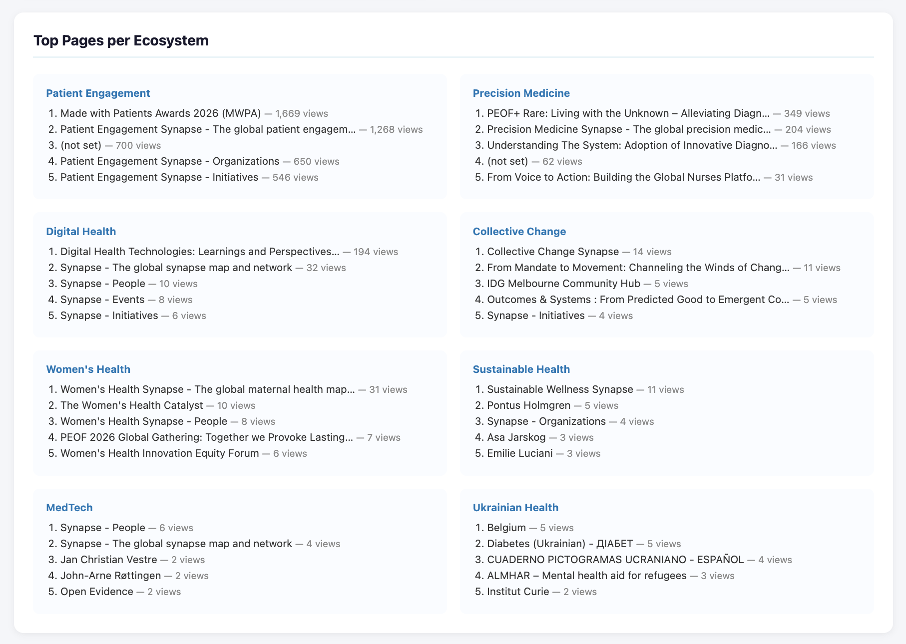

# GA4 Ecosystem Report — Automated Monthly Analytics

No more manual exports. This script connects to the GA4 API and generates a full 
monthly report across multiple website ecosystems in one run.

Output: a self-contained HTML dashboard + Excel file, ready to share with anyone.

---

## Preview




---

## What you get

- KPI cards with month-over-month deltas
- Daily active users trend chart
- Sessions breakdown by ecosystem
- Channel group analysis
- Source / medium table
- Top 5 pages per ecosystem
- Everything in one HTML file + Excel with 4 sheets

---

## Stack

Python · GA4 Data API · Pandas · Matplotlib · Jinja2 · OpenPyXL · Google Cloud

---

## Setup

**Install dependencies**
```bash
pip3 install google-analytics-data google-auth pandas openpyxl matplotlib jinja2 python-dateutil
```

**Google Cloud**
- Enable the Google Analytics Data API
- Create a Service Account → download the JSON key
- In GA4 → Admin → Property Access Management → add the service account email as Viewer

**Configure**
```python
CONFIG = {
    "property_id": "YOUR_GA4_PROPERTY_ID",
    "credentials_path": "service_account.json",
    "output_dir": ".",
    "report_month": None,  # leave as None to auto-use last month
}
```

**Run**
```bash
python3 ga4_monthly_report.py
```

---
